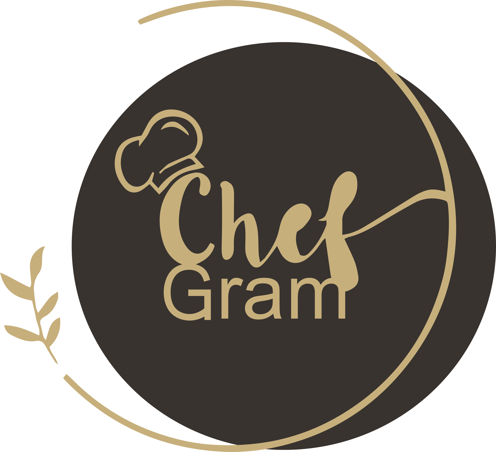
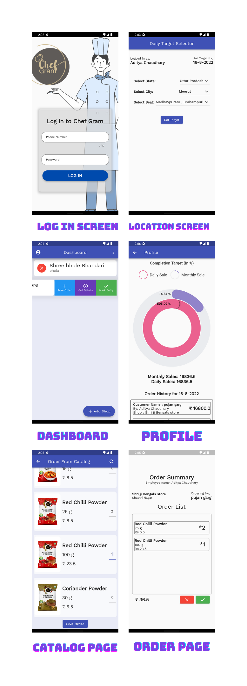

# Chef Gram
## _E-management application_

Chef Gram is a flutter based E-management app that can be used across multiple platforms. It can perform order management, track orders, provide summary of order data. It performs data analysis and uses charts to visualize order data. It's connected with firebase for storing data on database.  

Here are the key features in detail:

⭐ Perform order management

⭐ Place order directly from app

⭐ Uses GeoLocation to keep track of employee

⭐ Extensive analysis and provides summary of data

## Tech

## Plugins
  - cupertino_icons: ^1.0.2
  - firebase_core: ^1.8.0
  - firebase_auth: ^3.1.4
  - provider: ^6.0.1
  - sizer: ^2.0.15
  - cloud_firestore: ^2.5.4
  - flutter_slidable: ^0.6.0
  - syncfusion_flutter_charts: ^19.3.46
  - intl: ^0.17.0
  - url_launcher: ^6.0.12
  - font_awesome_flutter: ^9.2.0
  - geolocator: ^7.7.1
  - flutter_overlay_loader: ^1.0.3
  
## Getting Started

This project is a starting point for a Flutter application.

A few resources to get you started if this is your first Flutter project:

- [Lab: Write your first Flutter app](https://flutter.dev/docs/get-started/codelab)
- [Cookbook: Useful Flutter samples](https://flutter.dev/docs/cookbook)

For help getting started with Flutter, view our
[online documentation](https://flutter.dev/docs), which offers tutorials,
samples, guidance on mobile development, and a full API reference.

### Screenshots 📱

